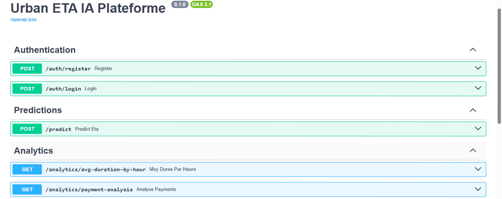

#  Smart LogiTrack : Urban ETA Prediction Platform

[](https://fastapi.tiangolo.com/)
[](https://spark.apache.org/)
[](https://airflow.apache.org/)
[](https://www.postgresql.org/)
[](https://scikit-learn.org/)
[](https://www.docker.com/)


##  Contexte General
**Smart LogiTrack** est une plateforme de "Control Tower" logistique permettant de prédire le Temps d'Arrivée Estimé (ETA) des taxis urbains. Ce projet implémente un pipeline complet : de l'ingestion massive de données (Bronze) au nettoyage distribué (Silver), jusqu'au déploiement d'une API de prédiction haute performance.

---

##  Architecture du Système

Le projet est construit sur une architecture  :
1.  **Ingestion (Bronze)** : Récupération automatique du dataset Taxi via Airflow.
2.  **Transformation (Silver)** : Nettoyage et Feature Engineering avec **PySpark** pour une scalabilité maximale.
3.  **Machine Learning** : Entraînement et comparaison de modèles (Spark ML vs Scikit-Learn).
4.  **Service (API)** : API REST (FASTAPI) sécurisée par JWT offrant des prédictions et des analyses analytiques.
5.  **Orchestration** : Gestion des tâches via Apache Airflow.

---

##  Structure du Projet

```text
├── api/                # Application Backend FastAPI
│   ├── core/           # Config (DB, JWT), Sécurité (hashing, verify-token)
│   ├── routers/        # Endpoints (Predict, Analytics, Auth)
│   ├── crud/           # Logique d'accès aux données (user.py)
│   ├── models/         # Modèles SQLAlchemy (history_predictions.py, users.py)
│   ├── outils/         # Utilitaires (execute_query, load_model, log_predictions)
│   ├── schemas/        # Validation Pydantic (predict_schema, users_schema)
│   ├── services/       # Logique métier (prediction.py)
│   ├── database.py     # Connexion Base de Données
│   ├── dependeces.py   # Injection de dépendances (get_db)
│   └── main.py         # Point d'entrée API
├── dags/               # Pipelines d'orchestration Apache Airflow
├── ML/                 # Scripts d'entraînement et recherche de modèles
│   ├── models_pkl/         # Modèles ML sérialisés (.pkl)
│   ├── notebooks/          # Exploration de données & prototypes Spark
│   └── Scripts/            # Fonctions utilitaires pour les DAGs Airflow
├── Tests/              # Tests unitaires et d'intégration (Pytest)
├── data/               # Stockage local des données (Bronze/Silver)
├── docker-compose.yml  # Orchestration des conteneurs
├── Dockerfile          # Configuration de l'image Docker API
├── .gitignore          # Fichiers à exclure de Git
├── .dockerignore       # Fichiers à exclure de l'image Docker
├── init_airflow.sh     # Script d'initialisation Airflow
└── requirements.txt    # Dépendances Python
```

---

##  Performance du Machine Learning

Nous avons mené une étude comparative entre deux approches pour prédire la durée du trajet (`trip_duree`) :

| Framework | Modèle | R² | RMSE |
| :--- | :--- | :--- | :--- |
| **Scikit-Learn** | **Random Forest Regressor** | **0.96** | **1.40** |
| Apache Spark | GBTRegressor | 0.93 | 1.88 |

> **Le modèle Random Forest (Sklearn)** a été choisi pour la production car il offre la meilleure précision et une latence de prédiction plus faible pour l'API.

---

##  Fonctionnalités de l'API

L'API est sécurisée par **JWT (JSON Web Tokens)** et propose les services suivants :

*   **Auth** : Inscription (`/register`) et Connexion (`/login`).
*   **Predictions** : 
    *   `POST /predict` : Reçoit les caractéristiques du trajet et renvoie la durée estimée.
    *   Historisation automatique de chaque requête dans la table `history_predictions`.
*   **Analytics** :
    *   `GET /analytics/avg-duration-by-hour` : Durée moyenne des trajets par heure.
    *   `GET /analytics/payment-analysis` : Analyse de la durée moyenne selon le type de paiement.

---
## Documentation de l'API

L'API est entièrement documentée avec **Swagger** et **ReDoc**. Vous pouvez tester chaque endpoint directement depuis votre navigateur.

### Aperçu de l'interface :
<p align="center">
  
</p>

### Accès :
*   **Swagger UI** : [http://localhost:8000/docs](http://localhost:8000/docs)
*   **ReDoc** : [http://localhost:8000/redoc](http://localhost:8000/redoc)


##  Installation et Démarrage

### 1. Prérequis
*   Windows avec **WSL2** ou Linux.
*   **Docker** & **Docker Compose**.

### 2. Installation locale
```bash
# Cloner le projet
git clone https://github.com/khadija199904/Urban-ETA-Prediction-Platform.git
cd Urban-ETA-Prediction-Platform

# Créer un environnement virtuel
python3 -m venv .venv
source .venv/bin/activate
pip install -r requirements.txt
```

### 3. Lancement des services
```bash
# Lancer Postgres, Airflow et l'API en arrière-plan
docker-compose up -d
```

### 4. Tests
Pour exécuter la suite de tests unitaires (avec mocks pour la DB et le Token) :
```bash
pytest
```

---
## CI/CD (GitHub Actions)

Ce projet utilise **GitHub Actions** pour l'Intégration Continue (CI). À chaque `push` sur la branche principale :
1.  **Environnement** : Un conteneur Ubuntu est configuré avec Python 3.12.
2.  **Dépendances** : Installation automatique de toutes les bibliothèques (`requirements.txt`).
3.  **Tests** : Exécution automatique de la suite de tests **Pytest** (incluant les mocks de l'API et de la base de données).
4.  **Qualité** : Vérification du succès des tests avant toute fusion (Pull Request).

---

## Stack Technologique
*   **Backend** : FastAPI, SQLAlchemy, Pydantic, JWT.
*   **Big Data** : Apache Spark (PySpark), Apache Airflow.
*   **Machine Learning** : Scikit-Learn (Random Forest), Spark MLlib.
*   **DevOps** : Docker, Docker Compose, WSL2.
*   **Base de données** : PostgreSQL.

---

##  Auteur
**Khadija**
*   [GitHub](https://github.com/khadija199904)
*   [Projet Repository](https://github.com/khadija199904/Urban-ETA-Prediction-Platform)

*Ce projet a été réalisé dans le cadre de la certification Développeur en Intelligence Artificielle.*